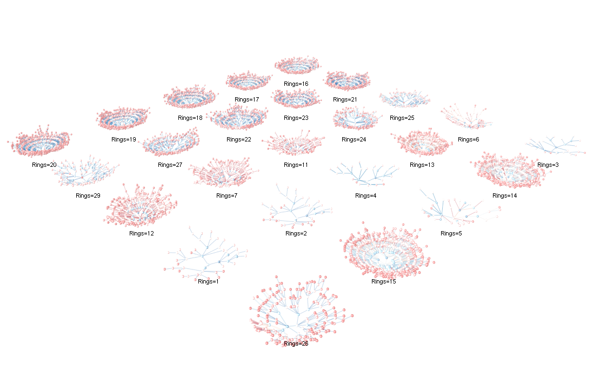

<p align="center">
  
</p>

<h1 align="center">
niarules - Numerical Association Rule Mining using Population-Based Nature-Inspired Algorithms
</h1>

<p align="center">
  <a href="https://github.com/firefly-cpp/niarules/actions?workflow=R-CMD-check">
    
  </a>
  <a href="https://CRAN.R-project.org/package=niarules">
    
  </a>
  <a href="https://cran.r-project.org/package=niarules">
    
  </a>
  <a href="https://doi.org/10.32614/CRAN.package.niarules">
    
  </a>
</p>

<p align="center">
  <a href="#-about">📋 About</a> •
  <a href="#-detailed-insights">✨ Detailed insights</a> •
  <a href="#-installation">📦 Installation</a> •
  <a href="#-usage">🚀 Usage</a> •
  <a href="#-reference-papers">📄 Reference papers</a> •
  <a href="#-license">🔑 License</a>
</p>

## 📋 About

niarules is an R framework designed for mining numerical association rules through the utilization of nature-inspired algorithms for optimization. Drawing inspiration from both the [NiaARM Python package](https://github.com/firefly-cpp/NiaARM) and [NiaARM.jl package](https://github.com/firefly-cpp/NiaARM.jl), this repository introduces the capability to perform numerical association rule mining in the R programming language.

The current version of niarules included in this framework offers seamless functionality for automatic dataset loading and preprocessing. It facilitates the exploration of numerical association rules through the application of nature-inspired algorithms, ultimately presenting a comprehensive output that includes identified association rules. Aligning with the principles of the original NiaARM implementation, the process of numerical association rule mining is conceptualized as an optimization problem, and the solution is achieved using population-based nature-inspired algorithms integrated within this framework. Besides the conventional numerical association rule mining, the current version also adds support for Segmented Interval Time Series Numerical Association Rule Mining as proposed in [NiaARMTS](https://github.com/firefly-cpp/NiaARMTS).

## ✨ Detailed insights
The current version includes (but is not limited to) the following functions:

- loading datasets in CSV format 📂
- preprocessing of data 🔄
- searching for association rules 🔍
- providing an output of mined association rules 📝
- generating statistics about mined association rules 📊
- providing the implementation of several state-of-the-art nature-inspired algorithms for optimization 🧬
- supporting the time series numerical association rule mining

## 📦 Installation

Install CRAN release version:

```R
install.packages("niarules")
```

## 🚀 Usage

### Basic run example (conventional datasets)

```R
library("niarules")

# Define the dataset file
dataset <- "Abalone.csv"

# Read dataset
data <- read_dataset(dataset)

# Extract feature information
features <- extract_feature_info(data)

# Determine problem dimension
dim <- problem_dimension(features, is_time_series = FALSE)

# Run Differential Evolution Algorithm
de <- differential_evolution(
  d = dim,
  np = 30,
  f = 0.5,
  cr = 0.9,
  nfes = 1000,
  features = features,
  data = data,
  is_time_series = FALSE
)

# Print identified association rules
print_association_rules(de$arules, is_time_series = FALSE)

# Save association rules to a CSV file
write_association_rules_to_csv(de$arules, "Rules.csv", is_time_series = FALSE)

```

### Basic run example (time series datasets)

```R
library("niarules")

# Define the dataset file (Ensure you have a time series dataset in CSV format)
dataset <- "ts2.csv"

# Read dataset
data <- read_dataset(dataset, timestamp_col = "timestamp")

# Extract feature information
features <- extract_feature_info(data)

# Determine problem dimension
dim <- problem_dimension(features, is_time_series = TRUE)

# Run Differential Evolution Algorithm for time series data
de <- differential_evolution(
  d = dim,
  np = 30,
  f = 0.5,
  cr = 0.9,
  nfes = 1000,
  features = features,
  data = data,
  is_time_series = TRUE
)

# Print identified association rules
print_association_rules(de$arules, is_time_series = TRUE, timestamps = data[["timestamp"]])

# Save association rules to a CSV file
write_association_rules_to_csv(de$arules, "Rules.csv", is_time_series = TRUE, timestamps = data[["timestamp"]])
```

### Basic run example (coral plot rendering)

```R
library(niarules)

data_raw <- niarules::read_dataset("inst/extdata/Abalone.csv")
features <- niarules::extract_feature_info(data_raw)
d <- niarules::problem_dimension(features, is_time_series = FALSE)

de <- niarules::differential_evolution(
  d        = d,
  np       = 30,
  f        = 0.5,
  cr       = 0.9,
  nfes     = 1000,
  features = features,
  data     = data_raw,
  is_time_series = FALSE
)

# parse the output data
parsed = parse_rules(de$arules)

# use the parsed data to build the plotting data
layout <- build_coral_plots(parsed)

# render the data with rgl
render_coral_rgl(
  layout$nodes, layout$edges, layout$grid_size,
  grid_color = "grey80",
  legend     = FALSE,
  label_mode   = "none",
  edge_width_metric  = "support",
  edge_width_range = c(1, 5),
  edge_width_transform = "linear",
  edge_color_metric  = "support",
  edge_gradient = c("#2166AC","#67A9CF","#D1E5F0","#FDDBC7","#EF8A62","#B2182B"),
  edge_color_transform = "log",
  node_color_by        = "type",
  node_gradient        = c("#204060","#5B8BB5","#D7E6F2","#F5D0C6","#E57373","#991C1C")
)
```

## Example Image



*Each “coral” groups all rules with the same RHS target **Rings = k** (title above each plot). Nodes are item bins/levels; edges connect prefix expansions as you move outward, so longer branches mean more specific antecedents. Encodings: **edge width ∝ lift**, **edge color = confidence** (cool→warm), **edge opacity ∝ support**; **node colors** are keyed by **item**. Rendered with `render_coral_rgl_experimental()` (theme `"studio"`) with slight height relief and jitter for readability.*

## 📚 Reference Papers

Ideas are based on the following research papers:

[1] Iztok Fister Jr., Dušan Fister, Iztok Fister, Vili Podgorelec, Sancho Salcedo-Sanz. [Time series numerical association rule mining variants in smart agriculture](https://iztok.link/static/publications/314.pdf). Journal of Ambient Intelligence and Humanized Computing (2023): 1-14.

[2] Iztok Fister Jr., Iztok Fister, Sancho Salcedo-Sanz. [Time Series Numerical Association Rule Mining for assisting Smart Agriculture](https://iztok.link/static/publications/298.pdf). In: International Conference on Electrical, Computer and Energy Technologies (ICECET). IEEE, 2022.

[3] I. Fister Jr., A. Iglesias, A. Gálvez, J. Del Ser, E. Osaba, I Fister. [Differential evolution for association rule mining using categorical and numerical attributes](https://www.iztok-jr-fister.eu/static/publications/231.pdf) In: Intelligent data engineering and automated learning - IDEAL 2018, pp. 79-88, 2018.

[4] I. Fister Jr., V. Podgorelec, I. Fister. [Improved Nature-Inspired Algorithms for Numeric Association Rule Mining](https://iztok-jr-fister.eu/static/publications/324.pdf). In: Vasant P., Zelinka I., Weber GW. (eds) Intelligent Computing and Optimization. ICO 2020. Advances in Intelligent Systems and Computing, vol 1324. Springer, Cham.

[5] I. Fister Jr., I. Fister [A brief overview of swarm intelligence-based algorithms for numerical association rule mining](https://arxiv.org/abs/2010.15524). arXiv preprint arXiv:2010.15524 (2020).

[6] Fister, I. et al. (2020). [Visualization of Numerical Association Rules by Hill Slopes](https://www.iztok-jr-fister.eu/static/publications/280.pdf).
    In: Analide, C., Novais, P., Camacho, D., Yin, H. (eds) Intelligent Data Engineering and Automated Learning – IDEAL 2020.
    IDEAL 2020. Lecture Notes in Computer Science(), vol 12489. Springer, Cham. https://doi.org/10.1007/978-3-030-62362-3_10

[7] I. Fister, S. Deb, I. Fister, [Population-based metaheuristics for Association Rule Text Mining](https://www.iztok-jr-fister.eu/static/publications/260.pdf),
    In: Proceedings of the 2020 4th International Conference on Intelligent Systems, Metaheuristics & Swarm Intelligence,
    New York, NY, USA, mar. 2020, pp. 19–23. doi: [10.1145/3396474.3396493](https://dl.acm.org/doi/10.1145/3396474.3396493).

[8] I. Fister, I. Fister Jr., D. Novak and D. Verber, [Data squashing as preprocessing in association rule mining](https://iztok-jr-fister.eu/static/publications/300.pdf), 2022 IEEE Symposium Series on Computational Intelligence (SSCI), Singapore, Singapore, 2022, pp. 1720-1725, doi: [10.1109/SSCI51031.2022.10022240](https://doi.org/10.1109/SSCI51031.2022.10022240).

[9] Stupan, Ž., & Fister Jr., I. (2022). [NiaARM: A minimalistic framework for Numerical Association Rule Mining](https://joss.theoj.org/papers/10.21105/joss.04448.pdf). Journal of Open Source Software, 7(77), 4448.

## See also

[1] [NiaARM.jl: Numerical Association Rule Mining in Julia](https://github.com/firefly-cpp/NiaARM.jl)

[2] [NiaARM: Numerical Association Rule Mining in Python](https://github.com/firefly-cpp/NiaARM)

[3] [arm-preprocessing: Implementation of several preprocessing techniques for Association Rule Mining (ARM)](https://github.com/firefly-cpp/arm-preprocessing)

[4] [NiaARMTS: Nature-Inspired Algorithms for Time Series Numerical Association Rule Mining](https://github.com/firefly-cpp/NiaARMTS)

## 🔑 License

This package is distributed under the MIT License. This license can be found online at <http://www.opensource.org/licenses/MIT>.

## Disclaimer

This framework is provided as-is, and there are no guarantees that it fits your purposes or that it is bug-free. Use it at your own risk!
